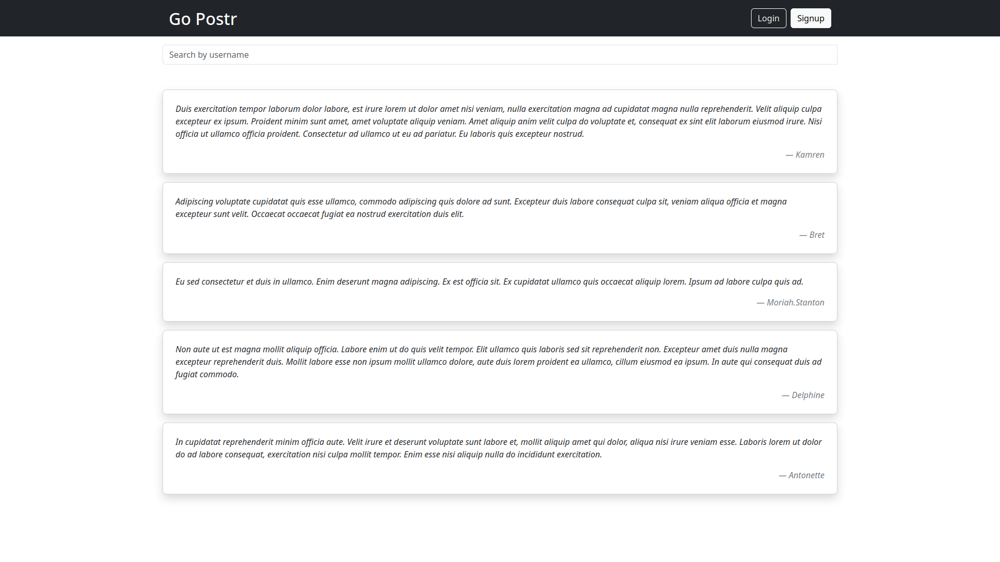
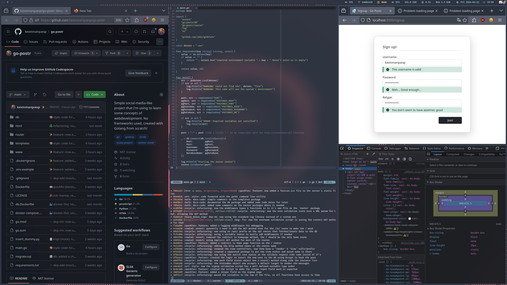

# Go Postr <em>under development</em>

Kind of Twitter clone that the users can log-in and post some text articles that
other users can read. Written in **Go** + **html/templates**, **bootstrap** and
**HTMX**.

Simple project that I created from scratch to learn a little bit about developing
simple web apps project and some other things - such as some Go strategies, devops
stuff, project's organization, etc. It's just an amateur project, but nothing will
stop you of contributing - let's learn together! :heart:

| Project demo               | i3wm flexing (selfie)             |
| -------------------------- | --------------------------------- |
|  |  |