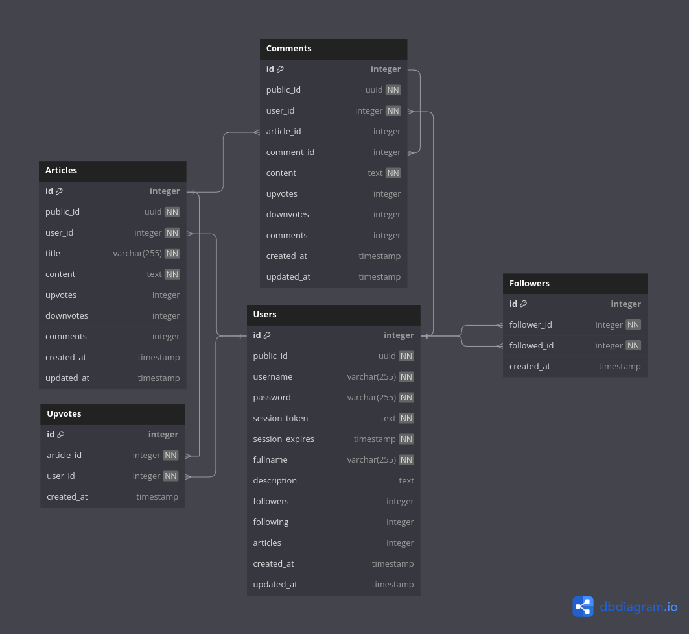

# Go Postr

Simple social-media-like project that I'm using to learn some fundamental
concepts of web dev. Created with Golang (and love) from scratch! :muscle:

## Project's Structure

I'm building this project to be flexible with new technologies that I may want
to implement in the future, such as Postgres, Reis, etc. So each function should
have any to little side effect.

The `interface` strategy to make the *controller* communicate with the database
will help me out on building some tests. For an example, I can pass a `dummyDB`
struct to the `initServerRouter()` that stores data in memmory, not in a real
database, allowing me to test the behavior of the handlers.

### Database

## Credentials Flow

+   *Signin*:
    1.  The user sends a new *username* and *password* to register.
    1.  The server registers this new user.
    1.  Generates a temporary session token on the database.
    1.  Then, give back that session token to the user.

+   *Login*:
    1.  The user sends a session token, or the credentials.
    1.  The server searchs for the user with that specific token (not authorized
        if doesn't exists, wasn't provided or was expired).
    1.  Updates the token expiration timestamp.
    1.  Proceed with the request, then give back what the user wants at the
        beginning.

> [!NOTE]
> The session tokens should have a expiration time on the server, but I think
> it's a good practice to also make the cookie have an expiration time. Just for
> security reasons.
